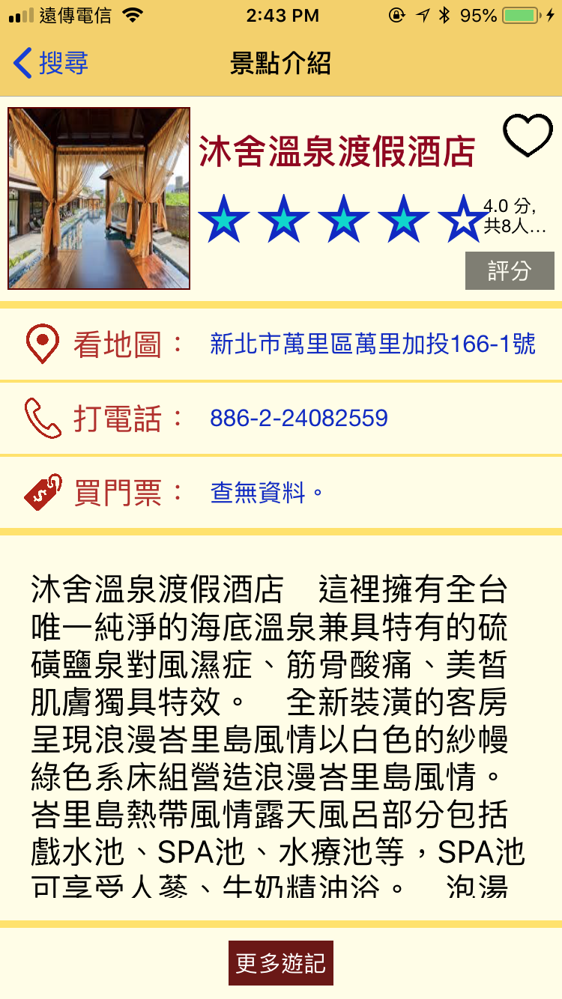
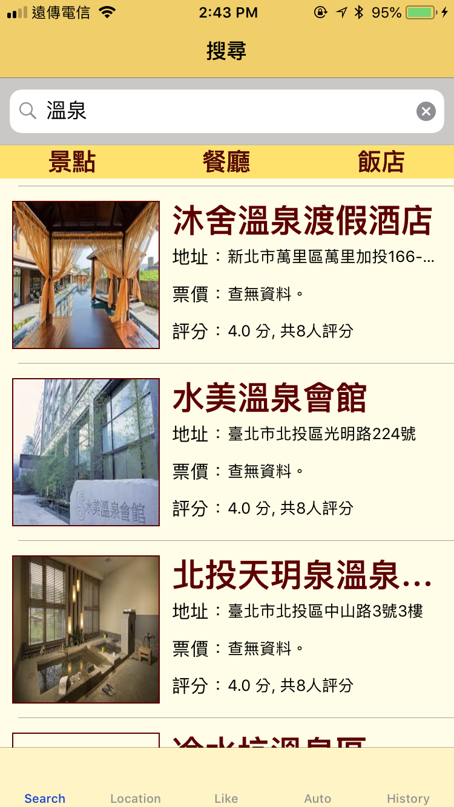
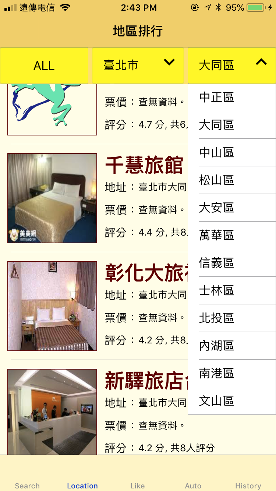
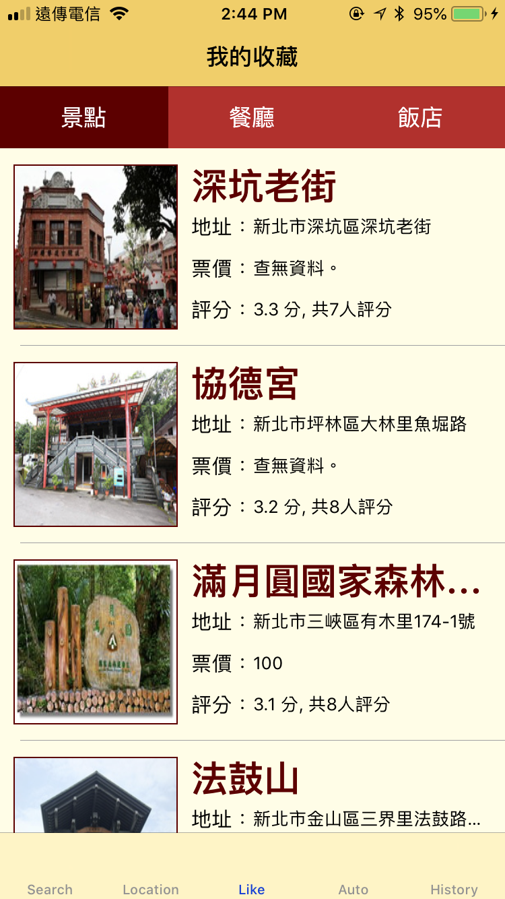
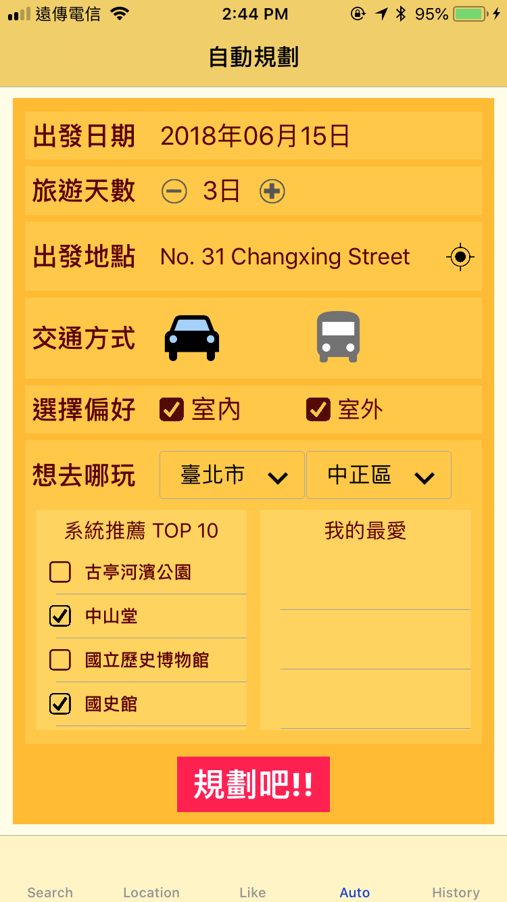
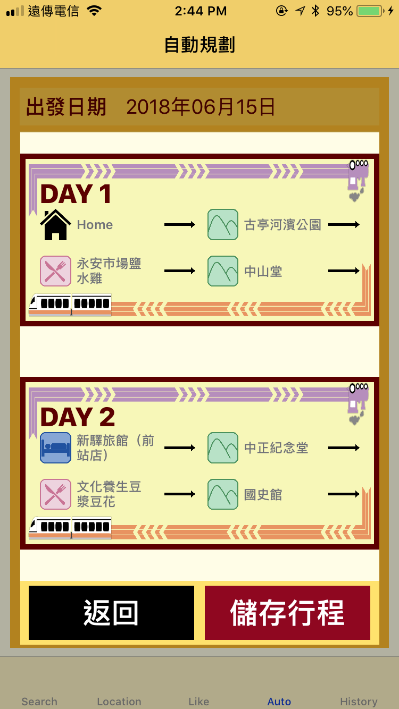
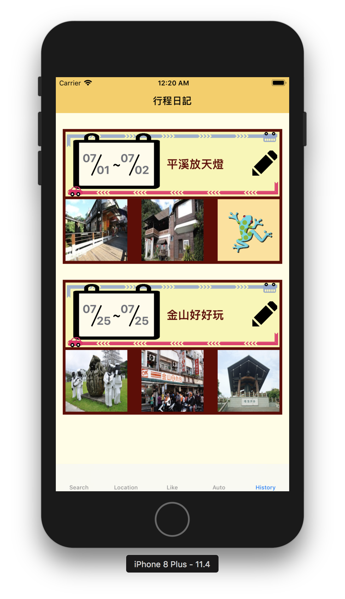

# Etrip

## Introduction
An IOS App that help users plan for their trip

People nowadays generally think that the work is too busy and leads to insufficient time. After returning home with a tired body, there is no time for a good tourism plan.So how do we solve it?

For this issue, we have developed a travel app with automatic planning function named ETrip.

We integrated government's open data and used program to crawl folk materials for application.


After collecting the data, we designed an innovative automatic planning function based on weather and scenic information combined with Google API.


scenic information: According to all users' ratings and "My Favorites" recommended spots.

Weather information: used to plan indoor or outdoor trips.

Google API: Design the smoothest itinerary based on the location of the attraction.


Finally save the trip as a "Travel Diary" for viewing.

## Prerequisite
- Swift 4+
- Google Distance Matrix API

### API Key Setup
- Set your Google Distance Matrix API
- [Apply Keys HERE](https://developers.google.com/maps/documentation/distance-matrix/intro)
- backupKey is optional
  - The API has free tier limits per day
```
//  eTrip/eTrip Views/AutoPlanView/AutoPlanViewController.swift

class AutoPlanViewController: UIViewController {

    var googleAPIKey = "------Please replace with your OWN Key------"
    let backupKey = ["------Please replace with your OWN Key------"]
    
    ...
}
```

## Members
- 王冠鈞 R06921107
- 蕭恬 R06943144
- 張媛媛 R06943164

## Screenshots
### Place detail


### Search


### Location Based


### Favorite Collections


### Autoplanning


### Plan Result
#### Overview


#### Detail view of each day


### Plan History



## DEMO video
- [LINK](https://www.youtube.com/watch?v=FJHvSbMxG7M&feature=youtu.be)
