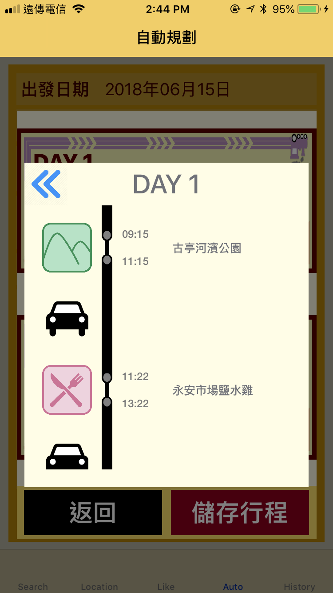
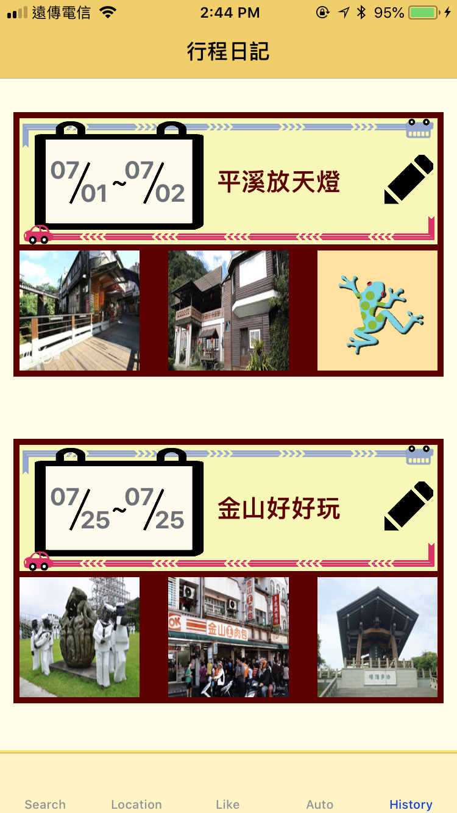

# Etrip

## Introduction
An IOS App that help users plan for their trip

### Usage Scenario
People nowadays usually have heavy work loads. 
Hardly can one has sufficient time or strength to come up with a good plan for vacations after tiring work.
So we're solving this problem !!!

### Our works
For this issue, we developed a travel app with automatic planning function named **ETrip**.

We integrated government's open data and crawled open data for our application.

#### Autoplanning
We designed an innovative automatic planning function based on weather and spot information combined with Google API.

##### Planning factors
- Spot selection: According to all users' ratings and **My Favorites** to recommend spots.

- Spot detail: Opening times, location, transpotation

- Weather information: Using the data to plan indoor or outdoor trips.

- Google API: Design the smoothest itinerary based on the location of the spot.


Finally, users can save the planned trip as a **Travel Diary** for future review.

## Prerequisite
- Swift 4+
- Google Distance Matrix API

### API Key Setup
- Set your Google Distance Matrix API
- [Apply Keys HERE](https://developers.google.com/maps/documentation/distance-matrix/intro)
- backupKey is optional
  - The API has free tier limits per day
```
//  eTrip/eTrip Views/AutoPlanView/AutoPlanViewController.swift

class AutoPlanViewController: UIViewController {

    var googleAPIKey = "------Please replace with your OWN Key------"
    let backupKey = ["------Please replace with your OWN Key------"]
    
    ...
}
```

## Members
- 王冠鈞 R06921107
- 蕭恬 R06943144
- 張媛媛 R06943164

## Screenshots
### Place detail
<kbd>

</kbd>

### Search


### Location Based


### Favorite Collections


### Autoplanning


### Plan Result
#### Overview


#### Detail view of each day


### Plan History



## DEMO video
- [LINK](https://www.youtube.com/watch?v=FJHvSbMxG7M&feature=youtu.be)
